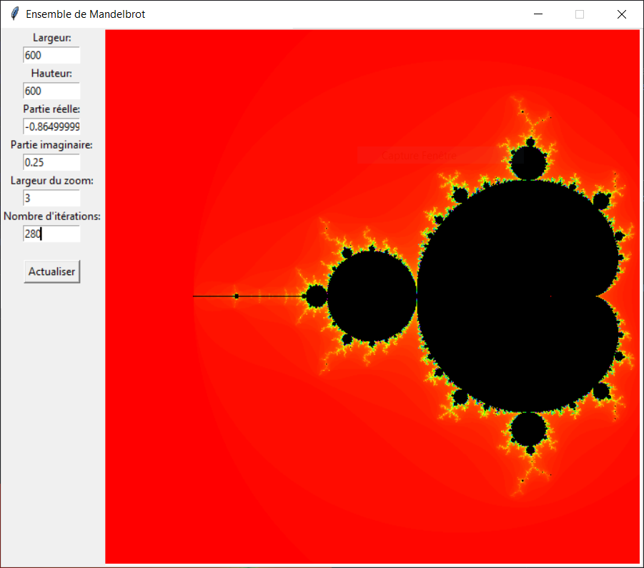
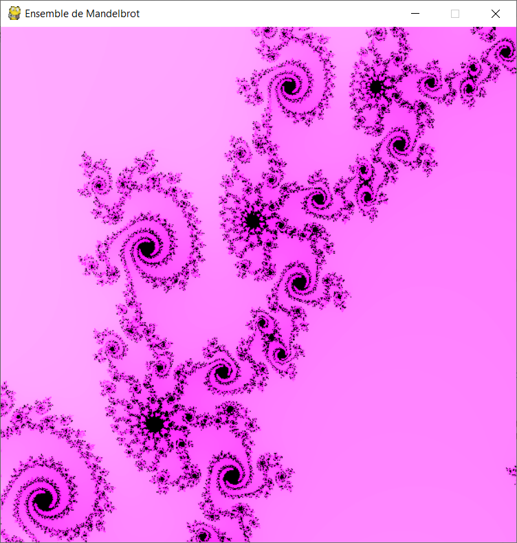

# MandelbrotSet
 A Mandelbrot set visualisation made in Python

Learn more about the <a href = "https://en.wikipedia.org/wiki/Mandelbrot_set">Mandelbrot set </a>

## The Mandelbrot set Explorer

## Exemple of visualisation

 

	
	
	
	
	
	

